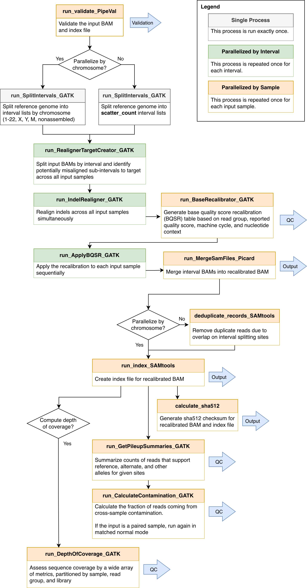

# recalibrate-BAM

1. [Overview](#overview)
2. [How To Run](#how-to-run)
3. [Flow Diagram](#flow-diagram)
4. [Pipeline Steps](#pipeline-steps)
5. [Inputs](#inputs)
5. [Outputs](#outputs)
6. [Discussions](#discussions)
7. [Contributors](#contributors)
8. [References](#references)

## Overview

This pipeline takes BAMs and corresponding indices from [pipeline-align-DNA](https://github.com/uclahs-cds/pipeline-align-DNA) and performs indel realignment and BQSR. It can be run with any combination of normal and tumor samples (normal only, tumor only, normal-tumor paired, multiple normal and tumor samples).

---

## How To Run

**The pipeline is currently configured to run on a SINGLE NODE mode with normal only, tumor only, normal-tumor paired, or multiple normal and tumor samples.**

1. Update the params section of the .config file ([Example config](config/template.config)).

2. Update the YAML ([Template YAMLs](input/)).

3. Download the submission script (submit_nextflow_pipeline.py) from [here](https://github.com/uclahs-cds/tool-submit-nf), and submit your pipeline below.

> **Note**: Because this pipeline uses an image stored in the GitHub Container Registry, you must follow the steps listed in the [Docker Introduction](https://uclahs-cds.atlassian.net/wiki/spaces/BOUTROSLAB/pages/3223396/Container+Registry+-+GitHub+Packages) on Confluence to set up a PAT for your GitHub account and log into the registry on the cluster before running this pipeline.

- YAML input
```
python submit_nextflow_pipeline.py \
       --nextflow_script /path/to/main.nf \
       --nextflow_config /path/to/call-gSNP.config \
       --nextflow_yaml /path/to/sample.yaml \
       --pipeline_run_name job_name \
       --partition_type <type> \
       --email email_address
```
---

## Flow Diagram



---

## Pipeline Steps

### 1. Split genome into sub-intervals for parallelization
Split the reference genome into [intervals for parallel processing](https://gatk.broadinstitute.org/hc/en-us/articles/4414602449435-SplitIntervals). If `params.parallelize_by_chromosome` is set then the genome will be split by chromosome, otherwise it will be split into up to `params.scatter_count` intervals.

### 2. Realign indels
Generate indel realignment targets and realign indels per interval.

### 3. Generate BQSR (Base Quality Score Recalibration)
Assess how sequencing errors correlate with four covariates (assigned quality score, read group, machine cycle producing this base, and current and immediately upstream base) and output [base quality score recalibration table](https://gatk.broadinstitute.org/hc/en-us/articles/4414594385563-BaseRecalibrator).

### 4. Apply BQSR per split interval in parallel
[Apply the base quality score recalibration](https://gatk.broadinstitute.org/hc/en-us/articles/4414594339611-ApplyBQSR) to each interval and reheader output as necessary.

### 5. Merge interval-level BAMs
[Merge BAMs](https://gatk.broadinstitute.org/hc/en-us/articles/4414594413083-MergeSamFiles-Picard-) from each interval to generate a whole sample BAM.

#### 5a. Deduplicate BAM
If `params.parallelize_by_chromosome` is not set, run a deduplication process to remove reads duplicated due to overlap on interval splitting sites.

### 6. Index BAM file
Generate a [BAI index file](http://www.htslib.org/doc/1.17/samtools-index.html) for fast random access of the whole sample BAM.

### 7. Get pileup summaries
Tabulate [pileup metrics](https://gatk.broadinstitute.org/hc/en-us/articles/4414586785947-GetPileupSummaries) for inferring contamination. Summarize counts of reads that support reference, alternate and other alleles for given sites.

### 8. Calculate contamination
Calculates the fraction of reads coming from [cross-sample contamination](https://gatk.broadinstitute.org/hc/en-us/articles/4414586751771-CalculateContamination), given results from Step 7. For paired samples, generates an additional output table containing segmentation of the tumor by minor allele fraction.

### 9.	DepthOfCoverage
If `params.is_DOC_run` is set, generate [coverage summary information](https://gatk.broadinstitute.org/hc/en-us/articles/4414586842523-DepthOfCoverage-BETA-) for the whole sample BAM from step 5, partitioned by sample, read group, and library.

### 10. Generate sha512 checksum
Generate sha512 checksum for final BAM and BAI files.

---

## Inputs

### Input YAML

| Field | Type | Description |
|:------|:-----|:------------|
| patient_id | string | Patient ID (will be standardized according to data storage structure in the near future) |
| normal_BAM | path | Set to absolute path to normal BAM |
| tumor_BAM | path | Set to absolute path to tumour BAM |

```
---
patient_id: "patient_id"
input:
  BAM:
    normal:
      - "/absolute/path/to/BAM"
      - "/absolute/path/to/BAM"
    tumor:
      - "/absolute/path/to/BAM"
      - "/absolute/path/to/BAM"

```

For normal-only or tumour-only samples, exclude the fields for the other state.

### Config

| Input Parameter | Required | Type | Description |
|:----------------|:---------|:-----|:------------|
| `dataset_id` | Yes | string | Dataset ID |
| `blcds_registered_dataset` | Yes | boolean | Set to true when using BLCDS folder structure; use false for now |
| `output_dir` | Yes | string | Need to set if `blcds_registered_dataset = false` |
| `save_intermediate_files` | Yes | boolean | Set to false to disable publishing of intermediate files; true otherwise; disabling option will delete intermediate files to allow for processing of large BAMs |
| `aligner` | Yes | string | Original aligner used to align input BAMs; formatted as \<aligner\>-\<aligner-version\> |
| `cache_intermediate_pipeline_steps` | No | boolean | Set to true to enable process caching from Nextflow; defaults to false |
| `is_emit_original_quals` | Yes | boolean | Set to true to emit original quality scores; false to omit |
| `is_DOC_run` | Yes | boolean | Set to true to run GATK DepthOfCoverage (very time-consuming for large BAMs); false otherwise |
| `parallelize_by_chromosome` | Yes | boolean | Whether the parallelize by chromosome or by scattering intervals |
| `scatter_count` | Yes | integer | Number of intervals to divide into for parallelization |
| `intervals` | Yes | path | Use all .list in inputs for WGS; Set to absolute path to targeted exome interval file (with .interval_list, .list, .intervals, or .bed suffix) |
| `gatk_ir_compression` | No | integer | Compression level for BAMs output by IndelRealigner. Default: 0. Range: 0-9 |
| `reference_fasta` | Yes | path | Absolute path to reference genome fasta file, e.g., `/hot/ref/reference/GRCh38-BI-20160721/Homo_sapiens_assembly38.fasta` |
| `bundle_mills_and_1000g_gold_standard_indels_vcf_gz` | Yes | path | Absolute path to Mills & 1000G Gold Standard Indels file, e.g., `/hot/ref/tool-specific-input/GATK/GRCh38/Mills_and_1000G_gold_standard.indels.hg38.vcf.gz` |
| `bundle_known_indels_vcf_gz` | Yes | path | Absolute path to known indels file, e.g., `/hot/ref/tool-specific-input/GATK/GRCh38/Homo_sapiens_assembly38.known_indels.vcf.gz` |
| `bundle_v0_dbsnp138_vcf_gz` | Yes | path | Absolute path to dbsnp file, e.g., `/hot/ref/tool-specific-input/GATK/GRCh38/resources_broad_hg38_v0_Homo_sapiens_assembly38.dbsnp138.vcf.gz` |
| `bundle_contest_hapmap_3p3_vcf_gz` | Yes | path | Absolute path to HapMap 3.3 biallelic sites file, e.g., `/hot/ref/tool-specific-input/GATK/GRCh38/Biallelic/hapmap_3.3.hg38.BIALLELIC.PASS.2021-09-01.vcf.gz` |
| `work_dir` | optional | path | Path of working directory for Nextflow. When included in the sample config file, Nextflow intermediate files and logs will be saved to this directory. With ucla_cds, the default is `/scratch` and should only be changed for testing/development. Changing this directory to `/hot` or `/tmp` can lead to high server latency and potential disk space limitations, respectively. |
| `docker_container_registry` | optional | string | Registry containing tool Docker images. Default: `ghcr.io/uclahs-cds` |
| `metapipeline_delete_input_bams` | optional | boolean | Set to true to delete the input BAM files once the initial processing step is complete. **WARNING**: This option should NOT be used for individual runs of call-gSNP; it's intended for metapipeline-DNA to optimize disk space usage by removing files that are no longer needed from the `workDir`. |
| `metapipeline_final_output_dir` | optional | string | Absolute path for the final output directory of metapipeline-DNA that's expected to contain the output BAM from align-DNA. **WARNING**: This option should not be used for individual runs of recalibrate-BAM; it's intended for metapipeline-DNA to optimize disk space usage. |
| `metapipeline_states_to_delete` | optional | list | List of states for which to delete input BAMs. **WARNING**: This option should not be used for individual runs of recalibrate-BAM; it's intended for metapipeline-DNA to optimize disk space usage. |
| `base_resource_update` | optional | namespace | Namespace of parameters to update base resource allocations in the pipeline. Usage and structure are detailed in `template.config` and below. |

#### Base resource allocation updaters
To update the base resource (cpus or memory) allocations for processes, use the following structure and add the necessary parts. The default allocations can be found in the [node-specific config files](./config/)
```Nextflow
base_resource_update {
    memory = [
        [['process_name', 'process_name2'], <multiplier for resource>],
        [['process_name3', 'process_name4'], <different multiplier for resource>]
    ]
    cpus = [
        [['process_name', 'process_name2'], <multiplier for resource>],
        [['process_name3', 'process_name4'], <different multiplier for resource>]
    ]
}
```
> **Note** Resource updates will be applied in the order they're provided so if a process is included twice in the memory list, it will be updated twice in the order it's given.

Examples:

- To double memory of all processes:
```Nextflow
base_resource_update {
    memory = [
        [[], 2]
    ]
}
```
- To double memory for `run_ApplyBQSR_GATK` and triple memory for `run_validate_PipeVal` and `run_IndelRealigner_GATK`:
```Nextflow
base_resource_update {
    memory = [
        ['run_ApplyBQSR_GATK', 2],
        [['run_validate_PipeVal', 'run_IndelRealigner_GATK'], 3]
    ]
}
```
- To double CPUs and memory for `run_ApplyBQSR_GATK` and double memory for `run_validate_PipeVal`:
```Nextflow
base_resource_update {
    cpus = [
        ['run_ApplyBQSR_GATK', 2]
    ]
    memory = [
        [['run_ApplyBQSR_GATK', 'run_validate_PipeVal'], 2]
    ]
}
```

---

## Outputs

| Output | Description |
|:-------|:------------|
| `<aligner>_<GATK>_<dataset_id>_<sample_id>.bam` | Post-processes BAM |
| `<aligner>_<GATK>_<dataset_id>_<sample_id>.bam.sha512` | Post-processes BAM SHA512 checksum |
| `<aligner>_<GATK>_<dataset_id>_<sample_id>.bam.bai` | Post-processes BAM index |
| `<aligner>_<GATK>_<dataset_id>_<sample_id>.bam.bai.sha512` | Post-processes BAM index SHA512 checksum |
| `report.html`, `timeline.html` and `trace.txt` | Nextflow report, timeline and trace files |
| `*.command.*` | Process specific logging files created by nextflow |

---

## Discussions

- [Issue tracker](https://github.com/uclahs-cds/pipeline-recalibrate-BAM/issues) to report errors and enhancement ideas.
- Discussions can take place in [recalibrate-BAM Discussions](https://github.com/uclahs-cds/pipeline-recalibrate-BAM/discussions)
- [recalibrate-BAM pull requests](https://github.com/uclahs-cds/pipeline-recalibrate-BAM/pulls) are also open for discussion

---

## Contributors

> Update link to repo-specific URL for GitHub Insights Contributors page.

Please see list of [Contributors](https://github.com/uclahs-cds/pipeline-recalibrate-BAM/graphs/contributors) at GitHub.

---

## References

--

## License

Authors: Yash Patel (YashPatel@mednet.ucla.edu), Shu Tao (shutao@mednet.ucla.edu), Stefan Eng (stefaneng@mednet.ucla.edu)

Recalibrate-BAM is licensed under the GNU General Public License version 2. See the file LICENSE for the terms of the GNU GPL license.

Recalibrate-BAM takes BAM files and utilizes GATK to perform indel realignment and BQSR.

Copyright (C) 2023 University of California Los Angeles ("Boutros Lab") All rights reserved.

This program is free software; you can redistribute it and/or modify it under the terms of the GNU General Public License as published by the Free Software Foundation; either version 2 of the License, or (at your option) any later version.

This program is distributed in the hope that it will be useful, but WITHOUT ANY WARRANTY; without even the implied warranty of MERCHANTABILITY or FITNESS FOR A PARTICULAR PURPOSE. See the GNU General Public License for more details.
